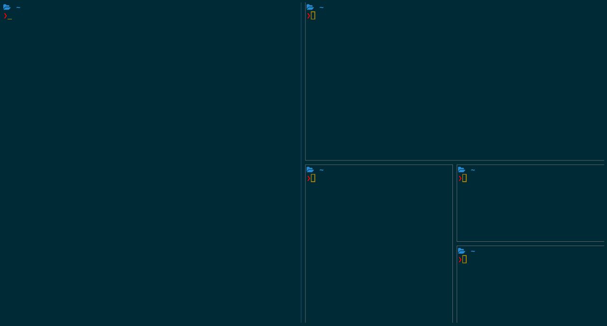

# i3-sway-spiral

Change the i3/sway layout to splith/splitv depending on node size,
to open new windows in a spiral motion.

Inspired by XMonad and https://github.com/nwg-piotr/autotiling



## Run

```
cargo run
```

You can get more verbose output using log levels, e.g.

```
# Using one of error, warn, info, debug, trace
RUST_LOG=info cargo run
```

## Build

```
cargo build --release
# binary is now in target/release/i3-sway-spiral
# run `strip` on the binary if you want to remove debug symbols
```